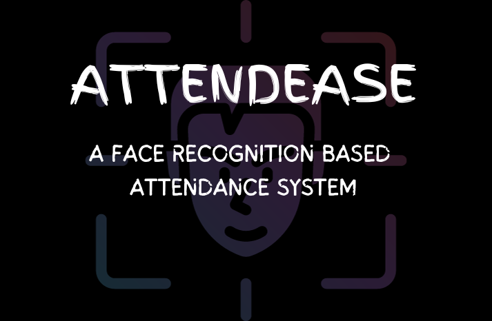

# Face Recognisation based Attendance System using LBPH Algorithm

## Overview

Welcome to the Attendance System using Machine Learning with the LBPH (Local Binary Pattern Histogram) algorithm. This project empowers teachers to streamline the process of managing student attendance using the power of computer vision and machine learning. With this system, you can effortlessly:

- Enter student details in the student section.
- Capture student photos through your camera.
- Train the LBPH model for facial recognition.
- Take attendance using your webcam and automatically record it in an Excel file.

## Features

- **User-Friendly Interface**: Designed with teachers in mind for ease of use.
- **Student Management**: Conveniently add, update, or delete student information.
- **Camera Integration**: Capture student images directly from your webcam.
- **LBPH Algorithm**: Utilize Local Binary Pattern Histogram for accurate facial recognition.
- **Attendance Recording**: Automatically save attendance data in an Excel file.
- **Model Training**: Train the model to improve recognition accuracy.

